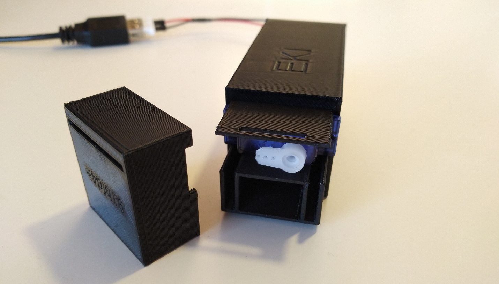

# lockbox-firmware

This repository is part of the [EKI Lockbox project](https://embeddedkink.com/lockbox). This repository contains the default firmware.

- The code on the main branch is published to [this installer](https://embeddedkink.com/lockbox-firmware/)
- [Repository for the enclosure](https://github.com/embeddedkink/lockbox-enclosure)

Upcoming new features:

- [ ] Add Emlalock integration
- [ ] Add Adventure Mode support
- [ ] Add image generation to web UI
- [ ] Add Improv WiFi support

Upcoming improvements:

- [ ] Add ESP32 support to web flasher
- [ ] Add documentation
- [ ] Move EEPROM functionality to FS
